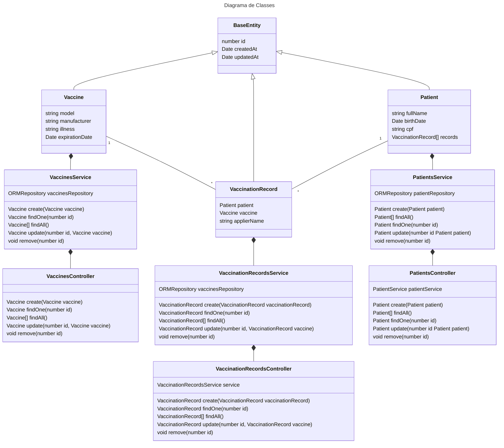
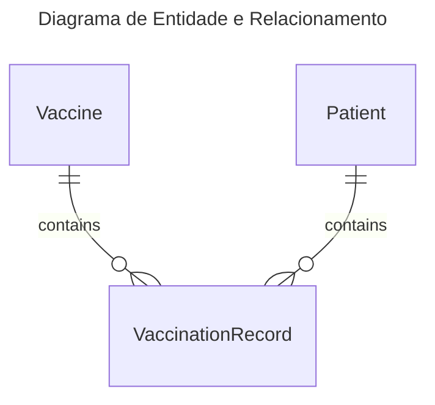

### Diagrama de Classes

```mermaid
---
title: Diagrama de Classes
---
classDiagram
class BaseEntity {
    number id
    Date createdAt
    Date updatedAt
}

%% Declare relationships between classes
BaseEntity <|-- Vaccine
BaseEntity <|-- VaccinationRecord
BaseEntity <|-- Patient
Vaccine *-- VaccinesService
Patient "1" -- "*" VaccinationRecord
Vaccine "1" -- "*" VaccinationRecord
Patient *-- PatientsService
PatientsService *-- PatientsController
VaccinesService *-- VaccinesController
VaccinationRecord *-- VaccinationRecordsService
VaccinationRecordsService *-- VaccinationRecordsController

class Vaccine {
    string model
    string manufacturer
    string illness
    Date expirationDate
}

class VaccinesService {
    ORMRepository vaccinesRepository
    Vaccine create(Vaccine vaccine)
    Vaccine findOne(number id)
    Vaccine[] findAll()
    Vaccine update(number id, Vaccine vaccine)
    void remove(number id)
}

class VaccinationRecord {
    Patient patient
    Vaccine vaccine
    string applierName
}

class Patient {
    string fullName
    Date birthDate
    string cpf
    VaccinationRecord[] records
}

class PatientsService {
    ORMRepository patientRepository
    Patient create(Patient patient)
    Patient[] findAll()
    Patient findOne(number id)
    Patient update(number id Patient patient)
    void remove(number id)
}

class PatientsController {
    PatientService patientService
    Patient create(Patient patient)
    Patient[] findAll()
    Patient findOne(number id)
    Patient update(number id Patient patient)
    void remove(number id)
}


class VaccinesController {
    Vaccine create(Vaccine vaccine)
    Vaccine findOne(number id)
    Vaccine[] findAll()
    Vaccine update(number id, Vaccine vaccine)
    void remove(number id)
}

class VaccinationRecordsService {
    ORMRepository vaccinesRepository
    VaccinationRecord create(VaccinationRecord vaccinationRecord)
    VaccinationRecord findOne(number id)
    VaccinationRecord[] findAll()
    VaccinationRecord update(number id, VaccinationRecord vaccine)
    void remove(number id)
}


class VaccinationRecordsController {
    VaccinationRecordsService service
    VaccinationRecord create(VaccinationRecord vaccinationRecord)
    VaccinationRecord findOne(number id)
    VaccinationRecord[] findAll()
    VaccinationRecord update(number id, VaccinationRecord vaccine)
    void remove(number id)
}

```

```mermaid
---
title: Diagrama de Entidade e Relacionamento
---
erDiagram
Vaccine ||--o{ VaccinationRecord : contains
Patient ||--o{ VaccinationRecord : contains
Patient
```
